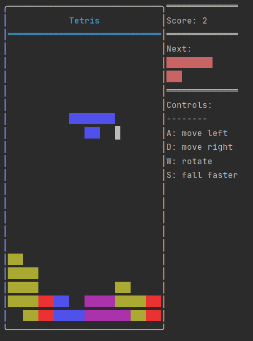
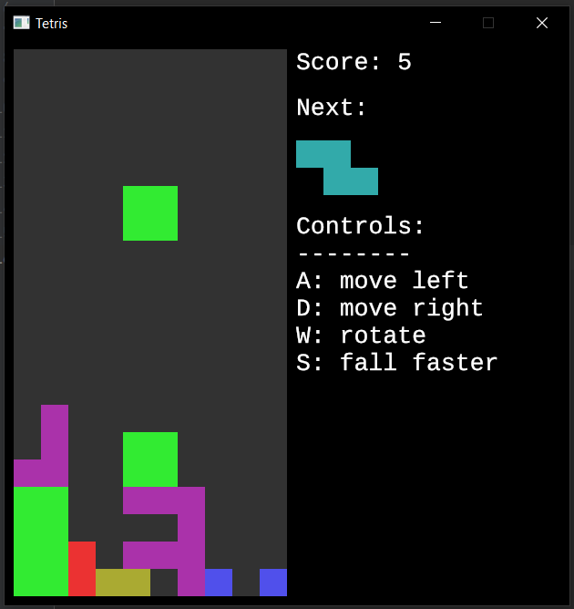

# tiny-games

Games like Tetris and Snake make up tiny grid worlds that fit well within a terminal! In this repo you'll find a small
selection of such games (and game-like toy projects). Since all the game code is decoupled from any terminal rendering
details, the games can also be run in a regular program window.

## Usage

Quickstart:
`cargo run`

Play Tetris in your terminal:
`cargo run -- --runtime terminal tetris`

or in a program window:
`cargo run -- --runtime window tetris`

  
   

